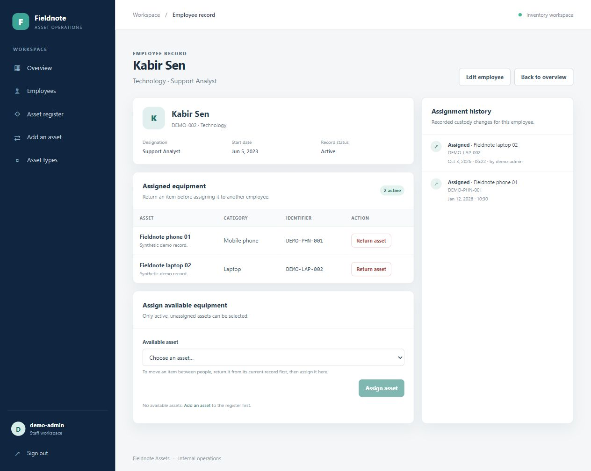
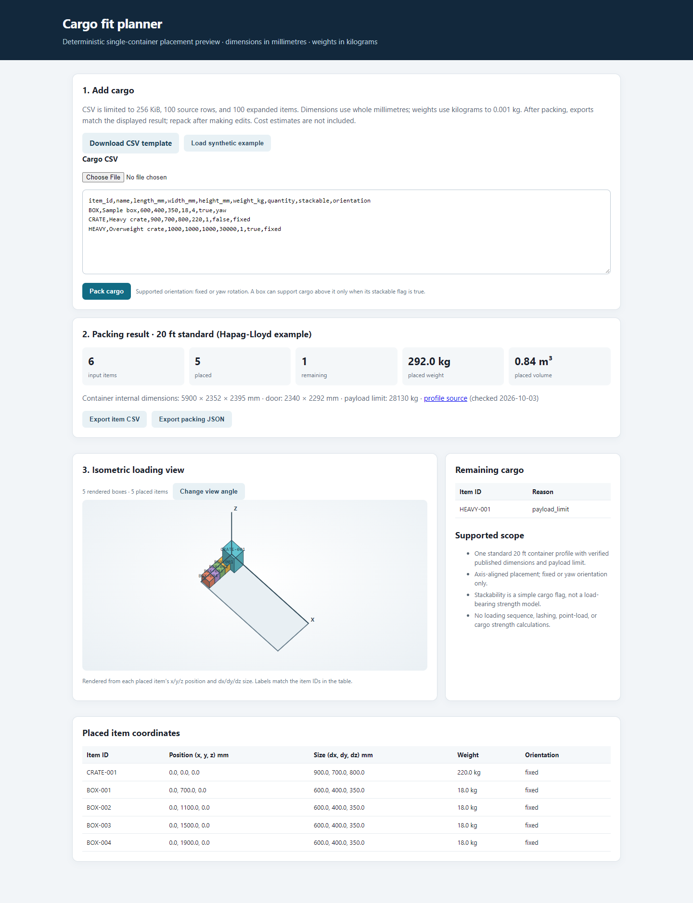

# ZephyrianDawnstrider

Curious builder with a few too many tabs open—usually somewhere between AI tools, logistics, and practical apps. I like turning side quests into small, testable projects people can explore.

**Tools across these projects:** Python · Django · CLI and browser workflows

## Selected projects

| Project | What it does | Status |
| --- | --- | --- |
| [Arena for ChatGPT + Codex](https://github.com/ZephyrianDawnstrider/arena-openai) | Budgeted tournament workflows for generating, reviewing, and refining candidate solutions. | [Released v0.3.2](https://github.com/ZephyrianDawnstrider/arena-openai/releases/tag/v0.3.2) |
| [Asset Management System](https://github.com/ZephyrianDawnstrider/asset_management_system) | Employee and asset records with assignment, return, and custody history. | Local MVP · 19 tests · single-operator SQLite |
| [Cargo Fit Planner](https://github.com/ZephyrianDawnstrider/cargo-fit-planner) | Quantity-aware cargo placement checks, a 3D view, and exports from the displayed plan. | Local MVP · 28 tests · one standard 20 ft profile |

### Project previews

Asset assignment history

Cargo Fit Planner

Screenshots use synthetic demo data.

### Side quest

[EngCalc](https://github.com/ZephyrianDawnstrider/EngCalc) — Educational bolt-shank shear-yield calculator · v1 · 33 tests · versioned reports.
